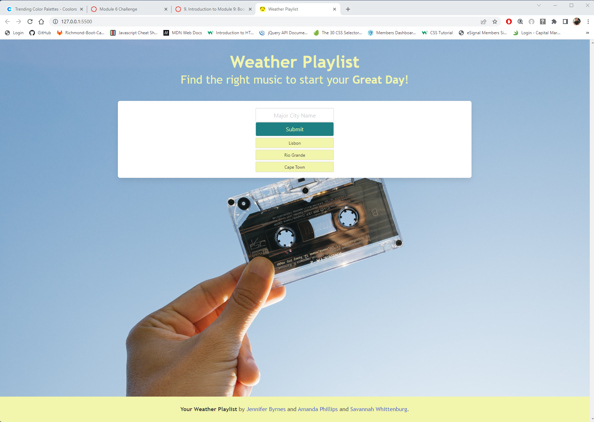
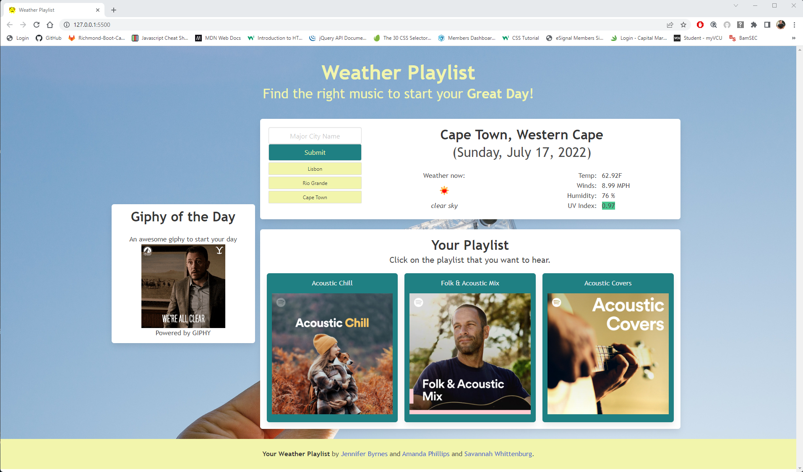

# Weather Playlist


## Build with:


## Description:

An application that display the current weather and a playlist that matches the temperature.

## Contents

- [Installation](#installation)
- [Usage](#usage)
- [Visuals](#visuals)
- [License](#license)
- [Contributing](#contributing)
- [Tests](#tests)
- [Questions](#questions)

## Installation

1. Clone the repo
   ```sh
   git clone git@github.com:babaphillips/weather-playlist.git
   ```
2. Run application thru Go Live Extension.

## Usage

This application can be used by anybody who wants a Playlist to match the current weather.

## Visuals




## License

This application is licensed under the MIT license.

## Contributing

Contributions are what make the open source community such an amazing place to learn, inspire, and create. Any contributions you make are welcome. If you have a suggestion that would make this better, please fork the repo and create a pull request.

1. Fork the Project.
2. Create your Feature Branch (`git checkout -b feature/NewFeature`).
3. Commit your Changes (`git commit -m 'Add some NewFeature'`).
4. Push to the Branch (`git push origin feature/New`).
5. Open a Pull Request.

## Tests

No tests.

## Questions?

Check the GitHub repository here: [GitHub](https://github.com/babaphillips/weather-playlist)

Check the deployed application here : [Deployed Application](https://babaphillips.github.io/weather-playlist/)

Check out my other projects at my Github here: [Github](https://github.com/babaphillips)

How To Reach Me For Additional Questions: amandavphillips@icloud.com
